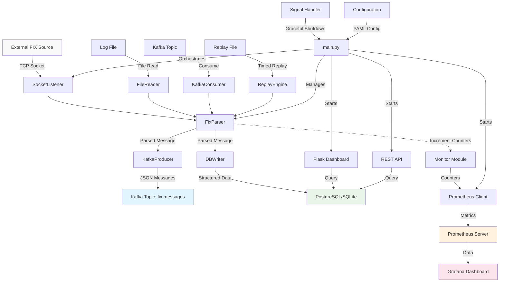

# FixFeeder Architecture

This document outlines the architecture of FixFeeder, a modular and extensible engine for processing financial protocol messages.

## 1. Guiding Principles

* **Modularity**: Each component (source, parser, queue, storage) is independent and can be swapped out.
* **Observability**: The system must provide metrics, logs, and audit trails for full visibility.
* **Reliability**: The system is designed for fault tolerance, including graceful shutdowns and restart safety.
* **Extensibility**: The architecture makes it easy to add support for new protocols (e.g., ITCH, OUCH) or new sinks (e.g., a different database).

## 2. System Architecture Overview

## 3. System Components

### 3.1. Source Layer (`fix_source/`)
This module is responsible for ingesting raw message data. It acts as the entry point to the system and supports multiple input types:

* **`SocketListener`**: Listens on a TCP socket for live FIX sessions
  - Handles multiple concurrent connections
  - Implements graceful shutdown via shutdown_event
  - Configurable host/port binding
  
* **`FileReader`**: Reads messages from historical log files
  - Line-by-line processing
  - Suitable for batch processing scenarios
  
* **`KafkaConsumer`**: Consumes raw messages from Kafka topics
  - Consumer group management
  - Configurable offset management
  - Timeout handling for non-blocking operation
  
* **`ReplayEngine`**: Simulates live feeds from historical data
  - Configurable replay speed multiplier
  - Checkpoint/recovery support for long replays

### 3.2. Protocol Parser Layer (`protocol_parsers/`)
The parser layer transforms raw messages into structured format:

* **`FixParser`**: Implements FIX protocol parsing logic
  - Parses `tag=value` pairs separated by SOH (`\x01`)
  - Enriches messages with ingestion timestamps
  - Supports configurable filtering based on tag values
  - Maps numeric tags to human-readable names
  - Enriches message types and side codes

* **`ProtocolParser`** (Abstract Base): Designed for future protocol support
  - Interface for ITCH, OUCH, and other financial protocols

### 3.3. Message Queue Layer (`queue/`)
Handles asynchronous message distribution:

* **`KafkaProducer`**: Publishes parsed messages to Kafka
  - JSON serialization
  - Configurable topic routing
  - Producer connection pooling

### 3.4. Storage Layer (`storage/`)
Provides persistent storage for audit and analysis:

* **`DBWriter`**: Multi-database support
  - PostgreSQL for production (JSONB support)
  - SQLite for development/testing
  - Automatic table creation and schema management
  - Timestamp parsing and normalization

### 3.5. Monitoring & Observability (`monitor.py`)
Implements metrics collection:

* **Prometheus Integration**: 
  - Message ingestion counters
  - Parse error tracking
  - Custom metrics via prometheus_client
  - HTTP endpoint for metrics scraping

### 3.6. Dashboard & API Layer
Provides real-time visibility:

* **Flask Dashboard** (`dashboard/`): Web-based message viewer
* **REST API** (`api/`): Programmatic access to message data
* **Database Abstraction** (`dashboard/db.py`): Unified database access

## 4. Design Choices & Rationale

### 4.1. Modular Architecture
- **Separation of Concerns**: Each module has a single responsibility
- **Testability**: Components can be unit tested in isolation
- **Flexibility**: Easy to swap implementations (e.g., SQLite ↔ PostgreSQL)

### 4.2. Threading Model
- **Source Thread**: Dedicated thread for message ingestion
- **Dashboard Thread**: Non-blocking web interface
- **Graceful Shutdown**: Signal handling with shutdown events

### 4.3. Configuration-Driven Design
- **YAML Configuration**: Centralized configuration management
- **Environment-Specific**: Easy deployment across environments
- **Feature Toggles**: Enable/disable components as needed

### 4.4. Message Processing Pipeline
- **Stream Processing**: Real-time message flow
- **Dual Sinks**: Kafka for real-time + Database for persistence
- **Error Handling**: Graceful degradation on parse failures

### 4.5. Observability First
- **Metrics**: Prometheus integration for monitoring
- **Logging**: Structured logging throughout
- **Dashboards**: Grafana integration for visualization

## 5. Technology Stack Decisions

### 5.1. Core Technologies
- **Python**: Rapid development, extensive ecosystem
- **Kafka**: Distributed streaming platform for scalability
- **PostgreSQL**: JSONB support for flexible message storage
- **Prometheus + Grafana**: Industry-standard monitoring stack

### 5.2. Containerization
- **Docker**: Consistent deployment environments
- **Docker Compose**: Multi-service orchestration
- **Volume Management**: Persistent data storage

## 6. Future Extensions

### 6.1. Protocol Support
- **ITCH Protocol**: NASDAQ market data feed
- **OUCH Protocol**: Order entry protocol
- **Binary Protocols**: FIX/FAST, proprietary formats
- **WebSocket Sources**: Modern real-time data feeds

### 6.2. Enhanced Processing
- **Message Validation**: Schema-based validation
- **Message Transformation**: Field mapping and enrichment
- **Complex Event Processing**: Pattern detection across message streams
- **Machine Learning**: Anomaly detection in message patterns

### 6.3. Scalability Improvements
- **Horizontal Scaling**: Multi-instance deployment
- **Kubernetes Support**: Cloud-native orchestration
- **Stream Processing**: Apache Flink/Kafka Streams integration
- **Sharding**: Partitioned message processing

### 6.4. Data Pipeline Extensions
- **Time Series Databases**: InfluxDB for time-series analytics
- **Data Lake Integration**: S3/HDFS for long-term storage
- **ETL Pipelines**: Automated data transformation workflows
- **Real-time Analytics**: Apache Spark integration

### 6.5. Enterprise Features
- **Authentication/Authorization**: RBAC for multi-tenant usage
- **Encryption**: End-to-end message encryption
- **Audit Trails**: Comprehensive compliance logging
- **Circuit Breakers**: Fault tolerance patterns
- **Rate Limiting**: Protection against message floods

### 6.6. Operational Enhancements
- **Health Checks**: Kubernetes-ready health endpoints
- **Distributed Tracing**: OpenTelemetry integration
- **Configuration Management**: Dynamic configuration updates
- **Backup/Recovery**: Automated data protection
- **Performance Profiling**: APM integration

## 7. Deployment Patterns

### 7.1. Development
- Local Docker Compose for full stack development
- Hot-reload for rapid iteration

### 7.2. Production
- Kubernetes deployment with Helm charts
- External Kafka cluster integration
- Managed database services
- Production-grade monitoring stack

This architecture provides a solid foundation for financial message processing while maintaining flexibility for future enhancements and scalability requirements.