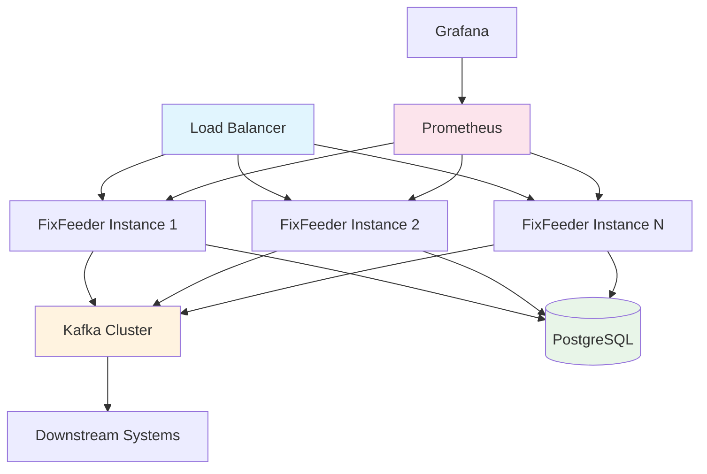

# FixFeeder Deployment Guide

This guide covers deployment strategies for FixFeeder across different environments, from development to production.

## Table of Contents

- [Deployment Overview](#deployment-overview)
- [Development Deployment](#development-deployment)
- [Staging Deployment](#staging-deployment)
- [Production Deployment](#production-deployment)
- [Kubernetes Deployment](#kubernetes-deployment)
- [Cloud Deployments](#cloud-deployments)
- [Monitoring & Alerting](#monitoring--alerting)
- [Security Considerations](#security-considerations)
- [Backup & Disaster Recovery](#backup--disaster-recovery)
- [Performance Tuning](#performance-tuning)

## Deployment Overview

FixFeeder supports multiple deployment patterns:

| Pattern | Use Case | Complexity | Scalability |
|---------|----------|------------|-------------|
| Single Node | Development, Testing | Low | Limited |
| Multi-Node | Staging, Small Production | Medium | Moderate |
| Kubernetes | Large Production, Cloud | High | High |
| Serverless | Event-driven Workloads | Medium | Auto |

### Architecture Components



## Development Deployment

### Local Docker Compose

The simplest deployment for development and testing:

```yaml
# docker-compose.dev.yml
version: '3.8'

services:
  fixfeeder:
    build: .
    ports:
      - "9876:9876"
      - "8000:8000"
      - "5001:5001"
    volumes:
      - ./config:/app/config
      - ./:/app  # Live code reload
    environment:
      - FLASK_ENV=development
      - LOG_LEVEL=DEBUG
    depends_on:
      postgres:
        condition: service_healthy
      kafka:
        condition: service_started

  postgres:
    image: postgres:13
    environment:
      POSTGRES_USER: fixfeeder_dev
      POSTGRES_PASSWORD: dev_password
      POSTGRES_DB: fixfeeder_dev
    ports:
      - "5432:5432"
    volumes:
      - postgres_dev_data:/var/lib/postgresql/data
    healthcheck:
      test: ["CMD-SHELL", "pg_isready -U fixfeeder_dev"]
      interval: 5s
      timeout: 5s
      retries: 5

  kafka:
    image: 'bitnami/kafka:3.7'
    ports:
      - '9092:9092'
    environment:
      - KAFKA_CFG_BROKER_ID=1
      - KAFKA_CFG_ZOOKEEPER_CONNECT=zookeeper:2181
      - ALLOW_PLAINTEXT_LISTENER=yes
      - KAFKA_CFG_ADVERTISED_LISTENERS=PLAINTEXT://localhost:9092
    depends_on:
      - zookeeper

  zookeeper:
    image: 'bitnami/zookeeper:3.9'
    environment:
      - ALLOW_ANONYMOUS_LOGIN=yes

volumes:
  postgres_dev_data:
```

**Deployment Commands:**
```bash
# Start development environment
docker-compose -f docker-compose.dev.yml up --build

# Run tests
docker-compose -f docker-compose.dev.yml exec fixfeeder pytest

# View logs
docker-compose -f docker-compose.dev.yml logs -f fixfeeder
```

### Local Python Development

For active development without Docker rebuilds:

```bash
# 1. Start infrastructure services
docker-compose up -d postgres kafka zookeeper

# 2. Set up Python environment
python -m venv venv
source venv/bin/activate  # Windows: venv\Scripts\activate
pip install -r requirements.txt

# 3. Configure for local development
export POSTGRES_HOST=localhost
export KAFKA_BROKERS=localhost:9092
export LOG_LEVEL=DEBUG

# 4. Run FixFeeder
python main.py
```

## Staging Deployment

### Multi-Node Setup

Staging environment with separate services for realistic testing:

```yaml
# docker-compose.staging.yml
version: '3.8'

networks:
  fixfeeder_network:
    driver: bridge

services:
  # Load balancer for multiple FixFeeder instances
  nginx:
    image: nginx:alpine
    ports:
      - "80:80"
      - "9876:9876"
    volumes:
      - ./nginx.staging.conf:/etc/nginx/nginx.conf
    depends_on:
      - fixfeeder-1
      - fixfeeder-2
    networks:
      - fixfeeder_network

  # FixFeeder instance 1
  fixfeeder-1:
    build: .
    environment:
      - INSTANCE_ID=1
      - POSTGRES_HOST=postgres
      - KAFKA_BROKERS=kafka-1:9092,kafka-2:9092
    volumes:
      - ./config:/app/config
    networks:
      - fixfeeder_network
    depends_on:
      postgres:
        condition: service_healthy

  # FixFeeder instance 2
  fixfeeder-2:
    build: .
    environment:
      - INSTANCE_ID=2
      - POSTGRES_HOST=postgres
      - KAFKA_BROKERS=kafka-1:9092,kafka-2:9092
    volumes:
      - ./config:/app/config
    networks:
      - fixfeeder_network
    depends_on:
      postgres:
        condition: service_healthy

  # PostgreSQL with replication
  postgres:
    image: postgres:13
    environment:
      POSTGRES_USER: fixfeeder_staging
      POSTGRES_PASSWORD: staging_secure_password
      POSTGRES_DB: fixfeeder_staging
    volumes:
      - postgres_staging_data:/var/lib/postgresql/data
      - ./postgres/postgresql.conf:/etc/postgresql/postgresql.conf
    healthcheck:
      test: ["CMD-SHELL", "pg_isready -U fixfeeder_staging"]
      interval: 10s
      timeout: 5s
      retries: 5
    networks:
      - fixfeeder_network

  # Kafka cluster
  kafka-1:
    image: 'bitnami/kafka:3.7'
    environment:
      - KAFKA_CFG_BROKER_ID=1
      - KAFKA_CFG_ZOOKEEPER_CONNECT=zookeeper:2181
      - KAFKA_CFG_ADVERTISED_LISTENERS=PLAINTEXT://kafka-1:9092
      - KAFKA_CFG_REPLICATION_FACTOR=2
    networks:
      - fixfeeder_network
    depends_on:
      - zookeeper

  kafka-2:
    image: 'bitnami/kafka:3.7'
    environment:
      - KAFKA_CFG_BROKER_ID=2
      - KAFKA_CFG_ZOOKEEPER_CONNECT=zookeeper:2181
      - KAFKA_CFG_ADVERTISED_LISTENERS=PLAINTEXT://kafka-2:9092
      - KAFKA_CFG_REPLICATION_FACTOR=2
    networks:
      - fixfeeder_network
    depends_on:
      - zookeeper

  zookeeper:
    image: 'bitnami/zookeeper:3.9'
    environment:
      - ALLOW_ANONYMOUS_LOGIN=yes
    networks:
      - fixfeeder_network

  # Monitoring stack
  prometheus:
    image: prom/prometheus:latest
    ports:
      - '9090:9090'
    volumes:
      - ./prometheus/prometheus.staging.yml:/etc/prometheus/prometheus.yml
      - prometheus_staging_data:/prometheus
    networks:
      - fixfeeder_network

  grafana:
    image: grafana/grafana-oss:latest
    ports:
      - '3000:3000'
    environment:
      - GF_SECURITY_ADMIN_PASSWORD=staging_admin_password
    volumes:
      - grafana_staging_data:/var/lib/grafana
      - ./grafana/provisioning/:/etc/grafana/provisioning/
    networks:
      - fixfeeder_network

volumes:
  postgres_staging_data:
  prometheus_staging_data:
  grafana_staging_data:
```

**NGINX Configuration (nginx.staging.conf):**
```nginx
events {
    worker_connections 1024;
}

stream {
    # Load balance FIX socket connections
    upstream fixfeeder_socket {
        server fixfeeder-1:9876;
        server fixfeeder-2:9876;
    }
    
    server {
        listen 9876;
        proxy_pass fixfeeder_socket;
        proxy_timeout 1h;
        proxy_responses 1;
    }
}

http {
    # Load balance HTTP traffic
    upstream fixfeeder_http {
        server fixfeeder-1:5001;
        server fixfeeder-2:5001;
    }
    
    server {
        listen 80;
        
        location / {
            proxy_pass http://fixfeeder_http;
            proxy_set_header Host $host;
            proxy_set_header X-Real-IP $remote_addr;
        }
        
        location /health {
            access_log off;
            return 200 "healthy\n";
            add_header Content-Type text/plain;
        }
    }
}
```

## Production Deployment

### Production Docker Compose

Hardened configuration for production use:

```yaml
# docker-compose.prod.yml
version: '3.8'

secrets:
  postgres_password:
    file: ./secrets/postgres_password.txt
  kafka_ssl_keystore:
    file: ./secrets/kafka.keystore.jks

services:
  fixfeeder:
    image: fixfeeder:${VERSION:-latest}
    deploy:
      replicas: 3
      resources:
        limits:
          cpus: '2.0'
          memory: 2G
        reservations:
          cpus: '1.0'
          memory: 1G
      restart_policy:
        condition: unless-stopped
        delay: 5s
        max_attempts: 3
    environment:
      - ENVIRONMENT=production
      - LOG_LEVEL=INFO
      - POSTGRES_PASSWORD_FILE=/run/secrets/postgres_password
      - KAFKA_SSL_ENABLED=true
      - METRICS_ENABLED=true
    secrets:
      - postgres_password
      - kafka_ssl_keystore
    volumes:
      - ./config/production:/app/config:ro
      - fixfeeder_logs:/app/logs
    healthcheck:
      test: ["CMD", "curl", "-f", "http://localhost:5001/health"]
      interval: 30s
      timeout: 10s
      retries: 3
      start_period: 40s

  postgres:
    image: postgres:13-alpine
    environment:
      POSTGRES_USER: fixfeeder_prod
      POSTGRES_DB: fixfeeder_prod
      POSTGRES_PASSWORD_FILE: /run/secrets/postgres_password
    secrets:
      - postgres_password
    volumes:
      - postgres_prod_data:/var/lib/postgresql/data
      - ./backups:/backups:ro
    deploy:
      resources:
        limits:
          cpus: '4.0'
          memory: 8G
        reservations:
          cpus: '2.0'
          memory: 4G
    healthcheck:
      test: ["CMD-SHELL", "pg_isready -U fixfeeder_prod"]
      interval: 10s
      timeout: 5s
      retries: 5

volumes:
  postgres_prod_data:
    driver: local
    driver_opts:
      type: none
      o: bind
      device: /opt/fixfeeder/data/postgres
  fixfeeder_logs:
    driver: local
    driver_opts:
      type: none  
      o: bind
      device: /opt/fixfeeder/logs
```

### Production Deployment Script

```bash
#!/bin/bash
# deploy_production.sh

set -euo pipefail

VERSION=${1:-latest}
ENVIRONMENT=${2:-production}

echo "Deploying FixFeeder $VERSION to $ENVIRONMENT"

# Pre-deployment checks
echo "Running pre-deployment checks..."

# Check Docker version
if ! docker version &>/dev/null; then
    echo "ERROR: Docker is not running"
    exit 1
fi

# Check available disk space (require 10GB)
AVAILABLE_SPACE=$(df /opt/fixfeeder | awk 'NR==2 {print $4}')
if [ "$AVAILABLE_SPACE" -lt 10485760 ]; then  # 10GB in KB
    echo "ERROR: Insufficient disk space. Need at least 10GB"
    exit 1
fi

# Check secrets exist
if [ ! -f "./secrets/postgres_password.txt" ]; then
    echo "ERROR: PostgreSQL password secret not found"
    exit 1
fi

# Backup current database
echo "Creating database backup..."
timestamp=$(date +%Y%m%d_%H%M%S)
docker-compose -f docker-compose.prod.yml exec postgres \
    pg_dump -U fixfeeder_prod fixfeeder_prod > \
    "backups/fixfeeder_backup_$timestamp.sql"

# Pull latest images
echo "Pulling Docker images..."
docker-compose -f docker-compose.prod.yml pull

# Rolling deployment
echo "Starting rolling deployment..."
docker-compose -f docker-compose.prod.yml up -d --no-deps fixfeeder

# Health check
echo "Waiting for health check..."
for i in {1..30}; do
    if curl -f http://localhost/health &>/dev/null; then
        echo "✓ Health check passed"
        break
    fi
    if [ "$i" -eq 30 ]; then
        echo "ERROR: Health check failed after 5 minutes"
        exit 1
    fi
    echo "Waiting for service to become healthy... ($i/30)"
    sleep 10
done

# Post-deployment verification
echo "Running post-deployment verification..."

# Check metrics endpoint
if ! curl -f http://localhost:8000/metrics &>/dev/null; then
    echo "WARNING: Metrics endpoint not responding"
fi

# Check database connectivity
if ! docker-compose -f docker-compose.prod.yml exec postgres \
    psql -U fixfeeder_prod -d fixfeeder_prod -c "SELECT 1;" &>/dev/null; then
    echo "ERROR: Database connectivity check failed"
    exit 1
fi

echo "✓ Deployment completed successfully"
echo "Version: $VERSION"
echo "Environment: $ENVIRONMENT"
echo "Timestamp: $(date)"
```

## Kubernetes Deployment

### Kubernetes Manifests

**Namespace:**
```yaml
# k8s/namespace.yaml
apiVersion: v1
kind: Namespace
metadata:
  name: fixfeeder
  labels:
    app: fixfeeder
    environment: production
```

**ConfigMap:**
```yaml
# k8s/configmap.yaml
apiVersion: v1
kind: ConfigMap
metadata:
  name: fixfeeder-config
  namespace: fixfeeder
data:
  config.yml: |
    source:
      type: socket
      host: 0.0.0.0
      port: 9876
    
    storage:
      type: postgresql
      postgres_config:
        user: fixfeeder
        host: postgres-service
        port: 5432
        database: fixfeeder
    
    queue:
      enabled: true
      type: kafka
      brokers: ["kafka-service:9092"]
      topic: fix.messages
    
    monitoring:
      enabled: true
      prometheus_port: 8000
    
    core:
      log_level: INFO
```

**Secrets:**
```yaml
# k8s/secrets.yaml
apiVersion: v1
kind: Secret
metadata:
  name: fixfeeder-secrets
  namespace: fixfeeder
type: Opaque
data:
  postgres-password: <base64-encoded-password>
  kafka-username: <base64-encoded-username>
  kafka-password: <base64-encoded-password>
```

**Deployment:**
```yaml
# k8s/deployment.yaml
apiVersion: apps/v1
kind: Deployment
metadata:
  name: fixfeeder
  namespace: fixfeeder
  labels:
    app: fixfeeder
spec:
  replicas: 3
  selector:
    matchLabels:
      app: fixfeeder
  template:
    metadata:
      labels:
        app: fixfeeder
    spec:
      containers:
      - name: fixfeeder
        image: fixfeeder:latest
        ports:
        - containerPort: 9876
          name: fix-socket
        - containerPort: 5001
          name: http
        - containerPort: 8000
          name: metrics
        env:
        - name: POSTGRES_PASSWORD
          valueFrom:
            secretKeyRef:
              name: fixfeeder-secrets
              key: postgres-password
        resources:
          requests:
            memory: "1Gi"
            cpu: "500m"
          limits:
            memory: "2Gi"
            cpu: "1000m"
        volumeMounts:
        - name: config
          mountPath: /app/config
          readOnly: true
        livenessProbe:
          httpGet:
            path: /health
            port: 5001
          initialDelaySeconds: 30
          periodSeconds: 10
        readinessProbe:
          httpGet:
            path: /health
            port: 5001
          initialDelaySeconds: 5
          periodSeconds: 5
      volumes:
      - name: config
        configMap:
          name: fixfeeder-config
```

**Service:**
```yaml
# k8s/service.yaml
apiVersion: v1
kind: Service
metadata:
  name: fixfeeder-service
  namespace: fixfeeder
  labels:
    app: fixfeeder
spec:
  selector:
    app: fixfeeder
  ports:
  - name: fix-socket
    port: 9876
    targetPort: 9876
    protocol: TCP
  - name: http
    port: 5001
    targetPort: 5001
  - name: metrics
    port: 8000
    targetPort: 8000
  type: LoadBalancer
```

**HorizontalPodAutoscaler:**
```yaml
# k8s/hpa.yaml
apiVersion: autoscaling/v2
kind: HorizontalPodAutoscaler
metadata:
  name: fixfeeder-hpa
  namespace: fixfeeder
spec:
  scaleTargetRef:
    apiVersion: apps/v1
    kind: Deployment
    name: fixfeeder
  minReplicas: 3
  maxReplicas: 10
  metrics:
  - type: Resource
    resource:
      name: cpu
      target:
        type: Utilization
        averageUtilization: 70
  - type: Resource
    resource:
      name: memory
      target:
        type: Utilization
        averageUtilization: 80
```

### Kubernetes Deployment Commands

```bash
# Deploy to Kubernetes
kubectl apply -f k8s/

# Check deployment status
kubectl get pods -n fixfeeder

# View logs
kubectl logs -f deployment/fixfeeder -n fixfeeder

# Scale deployment
kubectl scale deployment fixfeeder --replicas=5 -n fixfeeder

# Rolling update
kubectl set image deployment/fixfeeder fixfeeder=fixfeeder:v1.2.0 -n fixfeeder

# Check rollout status
kubectl rollout status deployment/fixfeeder -n fixfeeder
```

## Cloud Deployments

### AWS EKS Deployment

**Prerequisites:**
- AWS CLI configured
- eksctl installed
- kubectl installed

```bash
# Create EKS cluster
eksctl create cluster \
  --name fixfeeder-cluster \
  --version 1.21 \
  --region us-west-2 \
  --nodegroup-name fixfeeder-nodes \
  --node-type m5.large \
  --nodes 3 \
  --nodes-min 1 \
  --nodes-max 10 \
  --managed

# Deploy FixFeeder
kubectl apply -f k8s/

# Create load balancer
kubectl apply -f k8s/aws/load-balancer.yaml
```

### Google GKE Deployment

```bash
# Create GKE cluster
gcloud container clusters create fixfeeder-cluster \
  --num-nodes=3 \
  --machine-type=n1-standard-2 \
  --zone=us-central1-a \
  --enable-autoscaling \
  --min-nodes=1 \
  --max-nodes=10

# Get credentials
gcloud container clusters get-credentials fixfeeder-cluster --zone=us-central1-a

# Deploy FixFeeder
kubectl apply -f k8s/
```

### Azure AKS Deployment

```bash
# Create resource group
az group create --name fixfeeder-rg --location eastus

# Create AKS cluster
az aks create \
  --resource-group fixfeeder-rg \
  --name fixfeeder-cluster \
  --node-count 3 \
  --enable-addons monitoring \
  --generate-ssh-keys

# Get credentials
az aks get-credentials --resource-group fixfeeder-rg --name fixfeeder-cluster

# Deploy FixFeeder
kubectl apply -f k8s/
```

## Monitoring & Alerting

### Prometheus AlertManager Rules

```yaml
# prometheus/alert-rules.yml
groups:
- name: fixfeeder.rules
  rules:
  - alert: FixFeederDown
    expr: up{job="fixfeeder"} == 0
    for: 1m
    labels:
      severity: critical
    annotations:
      summary: "FixFeeder instance is down"
      description: "FixFeeder instance {{ $labels.instance }} has been down for more than 1 minute."

  - alert: HighParseErrorRate
    expr: rate(fix_parse_errors_total[5m]) > 0.1
    for: 2m
    labels:
      severity: warning
    annotations:
      summary: "High FIX parse error rate"
      description: "Parse error rate is {{ $value }} errors/second over the last 5 minutes."

  - alert: DatabaseConnectionFailure
    expr: database_write_errors_total > 0
    for: 1m
    labels:
      severity: critical
    annotations:
      summary: "Database connection failure"
      description: "FixFeeder cannot write to database."

  - alert: LowThroughput
    expr: rate(fix_messages_ingested_total[5m]) < 100
    for: 5m
    labels:
      severity: warning
    annotations:
      summary: "Low message throughput"
      description: "Message ingestion rate is {{ $value }} messages/second, below expected threshold."
```

### Grafana Dashboard Configuration

```json
{
  "dashboard": {
    "title": "FixFeeder Production Dashboard",
    "panels": [
      {
        "title": "Message Throughput",
        "type": "graph",
        "targets": [
          {
            "expr": "rate(fix_messages_ingested_total[1m])",
            "legendFormat": "Messages/sec"
          }
        ]
      },
      {
        "title": "Error Rate",
        "type": "graph", 
        "targets": [
          {
            "expr": "rate(fix_parse_errors_total[1m])",
            "legendFormat": "Parse Errors/sec"
          }
        ]
      },
      {
        "title": "System Resources",
        "type": "graph",
        "targets": [
          {
            "expr": "rate(container_cpu_usage_seconds_total{name=\"fixfeeder\"}[1m])",
            "legendFormat": "CPU Usage"
          },
          {
            "expr": "container_memory_usage_bytes{name=\"fixfeeder\"}",
            "legendFormat": "Memory Usage"
          }
        ]
      }
    ]
  }
}
```

## Security Considerations

### Network Security

**Firewall Rules:**
```bash
# Allow only necessary ports
iptables -A INPUT -p tcp --dport 9876 -s trusted_network/24 -j ACCEPT
iptables -A INPUT -p tcp --dport 5001 -s monitoring_network/24 -j ACCEPT
iptables -A INPUT -p tcp --dport 8000 -s monitoring_network/24 -j ACCEPT
```

**TLS Configuration:**
```yaml
# config/production/config.yml
dashboard:
  enabled: true
  host: 0.0.0.0
  port: 5001
  tls:
    enabled: true
    cert_file: /certs/fixfeeder.crt
    key_file: /certs/fixfeeder.key

monitoring:
  prometheus_port: 8000
  tls:
    enabled: true
    cert_file: /certs/metrics.crt
    key_file: /certs/metrics.key
```

### Database Security

**PostgreSQL Configuration:**
```postgresql
# postgresql.conf
ssl = on
ssl_cert_file = '/certs/server.crt'
ssl_key_file = '/certs/server.key'
ssl_ca_file = '/certs/ca.crt'

# pg_hba.conf
hostssl fixfeeder fixfeeder 0.0.0.0/0 md5
```

### Secrets Management

**Using Kubernetes Secrets:**
```bash
# Create secrets from files
kubectl create secret generic fixfeeder-secrets \
  --from-file=postgres-password=./secrets/postgres_password.txt \
  --from-file=kafka-keystore=./secrets/kafka.keystore.jks \
  -n fixfeeder

# Create TLS secrets
kubectl create secret tls fixfeeder-tls \
  --cert=./certs/fixfeeder.crt \
  --key=./certs/fixfeeder.key \
  -n fixfeeder
```

## Backup & Disaster Recovery

### Database Backup Strategy

**Automated Backup Script:**
```bash
#!/bin/bash
# backup_database.sh

BACKUP_DIR="/backups/fixfeeder"
DATE=$(date +%Y%m%d_%H%M%S)
RETENTION_DAYS=30

# Create backup directory
mkdir -p "$BACKUP_DIR"

# Perform backup
docker-compose exec postgres pg_dump \
  -U fixfeeder_prod \
  -h localhost \
  -p 5432 \
  fixfeeder_prod \
  | gzip > "$BACKUP_DIR/fixfeeder_backup_$DATE.sql.gz"

# Upload to S3 (if using AWS)
aws s3 cp "$BACKUP_DIR/fixfeeder_backup_$DATE.sql.gz" \
  s3://fixfeeder-backups/database/

# Clean old backups
find "$BACKUP_DIR" -name "*.sql.gz" -mtime +$RETENTION_DAYS -delete

echo "Backup completed: fixfeeder_backup_$DATE.sql.gz"
```

**Cron Job for Automated Backups:**
```bash
# Add to crontab
0 2 * * * /opt/fixfeeder/scripts/backup_database.sh
```

### Disaster Recovery Plan

**Recovery Procedure:**
```bash
#!/bin/bash
# disaster_recovery.sh

BACKUP_FILE="$1"

if [ -z "$BACKUP_FILE" ]; then
    echo "Usage: $0 <backup_file>"
    exit 1
fi

echo "Starting disaster recovery with backup: $BACKUP_FILE"

# Stop FixFeeder services
docker-compose down

# Restore database
gunzip -c "$BACKUP_FILE" | docker-compose exec -T postgres \
  psql -U fixfeeder_prod -d fixfeeder_prod

# Start services
docker-compose up -d

# Verify recovery
sleep 30
curl -f http://localhost:5001/health

echo "Disaster recovery completed"
```

## Performance Tuning

### System-Level Optimizations

**Linux Kernel Tuning:**
```bash
# /etc/sysctl.conf
net.core.rmem_max = 134217728
net.core.wmem_max = 134217728
net.ipv4.tcp_rmem = 4096 87380 134217728
net.ipv4.tcp_wmem = 4096 65536 134217728
net.core.netdev_max_backlog = 5000
net.ipv4.tcp_congestion_control = bbr

# Apply settings
sysctl -p
```

**File Descriptor Limits:**
```bash
# /etc/security/limits.conf
* soft nofile 65536
* hard nofile 65536
```

### Database Tuning

**PostgreSQL Configuration:**
```postgresql
# postgresql.conf
shared_buffers = 256MB
effective_cache_size = 1GB
checkpoint_completion_target = 0.9
wal_buffers = 16MB
default_statistics_target = 100
random_page_cost = 1.1
effective_io_concurrency = 200
work_mem = 4MB
min_wal_size = 1GB
max_wal_size = 4GB
```

### Application Tuning

**FixFeeder Configuration:**
```yaml
# config/production/config.yml
core:
  log_level: WARNING  # Reduce logging overhead
  worker_threads: 4   # Match CPU cores

queue:
  batch_size: 1000    # Batch Kafka messages
  linger_ms: 10       # Allow small batching delay
  compression_type: snappy

storage:
  batch_size: 100     # Batch database writes
  commit_interval: 1000  # Commit every 1000 messages
  connection_pool_size: 20
```

This comprehensive deployment guide covers all aspects of deploying FixFeeder from development to production environments, ensuring reliability, security, and scalability.
